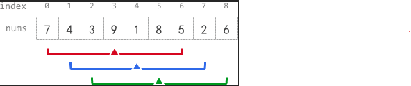

## 문제
정수 배열 nums(0-인덱스 배열)과 정수 k가 주어진다. 각 인덱스를 중심으로 반경 k를 갖는 부분 배열의 평균을 계산해야 한다. 평균은 주어진 범위 내 요소들의 합을 요소 개수로 나누어 정수 나눗셈(integer division)을 사용하여 구하며, 소수점 이하는 버려진다.

조건:<br>
인덱스 i를 중심으로 반경 k를 가지는 부분 배열은 [i - k]에서 [i + k]의 요소들을 포함한다.<br>
만약 i의 양쪽에 k만큼의 요소가 없을 경우(i - k보다 작은 인덱스가 존재하거나, i + k보다 큰 인덱스가 존재), 해당 i에 대한 반경 평균은 -1로 설정된다.<br>
길이가 n인 배열 avgs를 만들어야 한다.<br>
배열 avgs의 각 요소 avgs[i]는 중심 인덱스 i에 대한 k-반경 평균값이다.<br>

ex: 만약 4개의 요소가 2, 3, 1, 5일 경우, <br>그 평균은 (2 + 3 + 1 + 5) / 4 = 11 / 4 = 2.75이며 정수 나눗셈을 적용하면 2로 계산된다.

Example 1:



Input: nums = [7,4,3,9,1,8,5,2,6], k = 3
Output: [-1,-1,-1,5,4,4,-1,-1,-1]
Explanation:
- avg[0], avg[1], and avg[2] are -1 because there are less than k elements before each index.
- The sum of the subarray centered at index 3 with radius 3 is: 7 + 4 + 3 + 9 + 1 + 8 + 5 = 37.
  Using integer division, avg[3] = 37 / 7 = 5.
- For the subarray centered at index 4, avg[4] = (4 + 3 + 9 + 1 + 8 + 5 + 2) / 7 = 4.
- For the subarray centered at index 5, avg[5] = (3 + 9 + 1 + 8 + 5 + 2 + 6) / 7 = 4.
- avg[6], avg[7], and avg[8] are -1 because there are less than k elements after each index.

Example 2:

Input: nums = [100000], k = 0
Output: [100000]
Explanation:
- The sum of the subarray centered at index 0 with radius 0 is: 100000.
  avg[0] = 100000 / 1 = 100000.
Example 3:

Input: nums = [8], k = 100000
Output: [-1]
Explanation: 
- avg[0] is -1 because there are less than k elements before and after index 0.
 

Constraints:

`n == nums.length`
`1 <= n <= 105`
`0 <= nums[i], k <= 105`

### 풀이
윈도우 크기가 고정적이고, 왼쪽/오른쪽을 한 칸씩 이동하며 이전 합을 재활용함으로써 문제를 효율적으로 풀 수 있기 때문에 Sliding Window기법을 적용하였다.

```
Arrays.fill(avgs, -1);
...
int right = k + k;
if (right >= n)
    return avgs;
```
k 이전의 인덱스와 nums.length - 1 - k 이후의 인덱스에는 유효한 평균을 계산할 수 없으므로 -1을 채운다. 또한, k+k >= nums.length이면 유효한 인덱스가 하나도 없으므로, 모두 -1로 채워진 avgs를 반환.

```
if (k == 0)
  return nums;
```
nums = [100000], k = 0처럼 k가 0인 경우엔 Output이 nums와 동일해야 하기 때문에 nums를 return해준다. 

```
long sum = 0;
  for (int i = 0; i <= right; i++) {
      sum += nums[i];
  }
```
제약 조건을 보면 모든 요소가 최댓값(10⁵)이고, k가 큰 경우 sum의 값이 int의 범위를 넘길 수 있으므로 long으로 선언한다.
첫 번째 유효한 윈도우 합을 구하기 위해 nums[0]부터 nums[right]까지의 값을 더해준다.
이를 통하여 불필요한 중복 계산 없이 한 칸씩 이동하면서 sum을 업데이트할 수 있단.

```
for (int i = k; i < n - k; i++) {
  avgs[i] = (int) (sum / (2 * k + 1));

  if (++right < n) {
      sum += nums[right] - nums[i - k];
  } else {
      return avgs;
  }
}
```
유효한 인덱스부분을 순회한다.
먼저 sum의 평균을 avgs[i]에 넣어준다.

`++right < n`조건을 만족할 경우, 새로운 요소의 값을 더해주고, 가장 왼쪽 요소의 값(i-k)을 제외하여 sum에 넣어준다.

`++right < n`에 만족하지 않은 경우는 배열의 범위를 넘은 것이기 때문에 바로 return을 해준다.

```
return avgs;
```
여기서의 `return avgs`는 모든 유효한 인덱스에 대한 처리가 끝났을 때 결과를 반환한다.